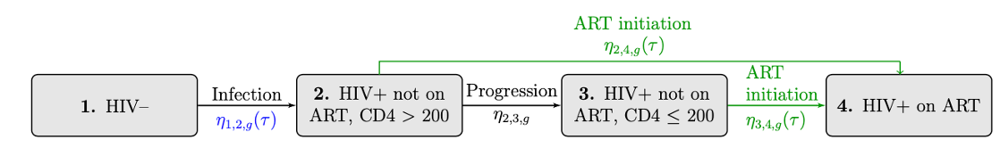

## Optimal Budget Allocation Approach to Regional Tuberculosis and HIV Care Delivery Programs Considering Equity, Effectiveness, and Uncertainty

### Contents in the repository:
1. [About the Approach](#about)
2. [Description of Parameter Files](#parameter_files)
3. [Descriptions of Model Execution Files](#model_execution)
4. [Description of Results Files](#results)

### About the Approach 
This repositiory contains the files needed to run an optimal budget allocation approach to regional TB and HIV care delivery programs in South Africa. The dynamic transmission model and optimization was programmed in R version 3.5.2 and the system of differential equations was solved with the deSolve package. I ran the code on Hyak, the University of Washington's supercomputing system, to allow for computations at scale.

Disease progression is modeled with a dynamic transmission model in the nine South African provinces under facility-based and community-based care delivery programs. Model uncertainties in disease
progression are considered by identifying a range of parameter sets that meet calibration targets. Model projections are used to quantify health outcomes and program costs used in a multi-objective optimization approach. The approach minimizes two objectives representing inequities in TB- and HIV-related mortality rates between regions and total TB- and HIV-related deaths. A given budget constrains the total program costs. A set of Pareto optimal solutions with sufficient statistical evidence that they satisfy the budget constraint and are non-dominated is returned. 

#### Illustration of Transitions used in the Dynamic Transmission Model to Describe TB and HIV Disease Drogression
<figure>
  <figcaption> **TB Transitions** </figcaption>
  
</figure>
<figure>
  <figcaption> **HIV Transitions** </figcaption>
  
</figure>
Above is an illustration of the rates of flow for the TB and HIV dynamic transmission model. Rates of flow between each compartment are governed by differential equations, as described in the appendix. Differential equations govern rates of flow between each compartment. Each tuberculosis (TB) compartment is stratified across two TB drug-resistance compartments, four human immunodeficiency virus (HIV) compartments, and two genders. The latent TB infection (LTBI) compartment is distinguished by those infected within two years, considered recent, and more than two years, considered remote. Individuals can age into TB compartments 1 (uninfected), 2 and 3 (LTBI, recent and remote, no TPT), and 6 (active TB), and HIV compartments 1 (HIV–) and 2 (HIV+, not on ART, CD4 > 200). Individuals can age out or die from any compartment. TB preventative therapy (TPT) initiations are highlighted in green to emphasize that care delivery programs directly impact them. TB force of infection is highlighted in blue to indicate the care delivery program indirectly impact them.

#### Example Illustration of Pareto Optimal Solutions Returned by the Multi-Objective Optimization Approach 
<figure>
  
</figure>

Illustration of the trade-offs of ten Pareto optimal solutions, including the sample means and 95% confidence intervals for the
two objectives. Solutions 1-5 are highlighted in blue to indicate that
these solutions are non-dominated if we only consider the sample means of the objective functions. Solutions 6-10 are also included because they are non-dominated when considering 95% confidence intervals of the objective functions.

#### param_files (folder) 
the param_files folder contains raw input data and scripts used to generate calibration sets and input data (when generated from multiple sources). A detailed description of parameters are described in Section 5 of the appendix.

* **calculated_param_gen (folder)** this folder uses the data in the raw_input_data (folder) and scripts to generate input parameters including: calibration sets from ranges; dynamic parameters generated from multiple sources including (baseline non-disease mortality rates), HIV incidence rates, birth proportions; initial population states; and program specific parameters (ART coverage and TPT initiation)
  * **raw_input_data (folder)** this folder contains raw input data sources from GBD, DOART, the DRIVE model.
  * *1_pop_estimates_calc.R (script)*: this script is used to generate population estimates for males and females in the nine provinces of South Africa between the ages of 15 and 59 and 10 to 15 using GBD data. The many of the parameter generation scripts use population estimates so you should run this script first. Outputs are written to the /param_files/calculated_param_gen/raw_input_data/GBD (folder) 
  * *2_base_mort_rate_gen.R (script)*: this script is used to generate baseline mortality rates for the years between 1990 and 2017 for males and females in the nine provinces of South Africa between the ages of 15 and 59 using GBD data. In the dynamic transmission model we use baseline mortality rate estimates from 1990 for any years prior to 1990, and estimates from 2017 for any years after 2017. Data outputs are written to the /param_files/input_parameters (folder), visualization of baseline mortality rates are written to /param_files/dynamic_param_graphs
  * *3_hiv_incidence_rate_gen.R (script)*: this script is used to generate HIV incidence rates for the years between 1980 and 2027 for males and females in the nine provinces of South Africa between the ages of 15 and 59 using GBD data and DO ART data (on the projected annual rate of change of HIV incidence rates under facility-based ART and community-based IPT from 2018 to 2027). Data outputs are written to the /param_files/input_parameters (folder), visualization of baseline mortality rates are written to /param_files/dynamic_param_graphs
  * *4_births_perc_overtime_and_pop_init_calc.R (script)*: this script is used to generate initial population estimates in 1940 and the proportion of births into each compartment across the nine provinces of South Africa
  * *5_ipt_initiation_calc.R (script)*: this script is used to generate TPT (TPT with isoniazid) values between 2005 and 2027 for each program (based on trial data). 
  * *6_ART_prop_eligible_gen.R (script)*: this script is used to generate the proportion of those in HIV compartment 2 (HIV+, not on ART, CD4 > 200) eligible to initiate ART between 2011 and 2015 based on findings from the DO ART study. Outputs are written to the /param_files/input_parameters (folder)
  * *7_ART_coverage_calc.R (script)*: this script is used to generate ART coverage values between 2004 and 2027 for each program. 
  * *8_target_param_gen.R (script)*: this script is used to generate three regional and one national target calibration range from GBD estimates.
  * *9_sample_gen.R (script)*: this script is used to generate the 10,000 regional parameter sets used in calibration using Latin hypercube sampling. 
  * *a_accepted_calib_points_distribution_gen.R (script)*: this script is used to generate histograms to evaluate distribution of accepted parameter sets (after running the calibration). 
    
* **distribution_of_accepted_points_graphs(folder)** histograms to evaluate distribution of accepted parameter sets (after running the calibration) 

* **dynamic_param_graphs (folder)** visualization of mean HIV incidence and baseline mortality rates

* **input_parameters (folder)** contains all the input parameters used in the dynamic transmission model as described in Section 5.1 to Section 5.3 in the appendix, as well as the 100,000 parameter sets generated using Latin hypercube sampling for calibration:
  * *art_coverage_df.csv*, ART coverage for males and females starting (for each program during the intervention period) 
  * *art_prop_eligible_df.csv*, The proportion of those in HIV compartment 2 (HIV+, not on ART, CD4 > 200) eligible to initiate ART between 2011 and 2015 based on findings from the DO ART study. 
  * *base_mort_df.csv*, baseline (non-disease) mortality rates for males and females
  * *birth_perc_df_overtime.csv*, The proportion of individuals aging into the model into each compartment by year.
  * *calibration_sets_df.csv*, 100,000 calibration sets generated with Latin hypercube sampling
  * *hiv_inc_df.csv*, HIV incidence rates for males and females (by facility-based and community-based programs during the intervention period)
  * *ipt_initiation_df.csv*, IPT initiation for males and females starting (for each program during the intervention period) 
  * *pop_init_df_1940.csv*, Initial population states in 1940

* **target_calibration_estimates (folder)** target calibration ranges are generated using the script */param_files/calculated_param_gen/8_target_param_gen.R*, the script generates target calibration ranges for:
  * HIV prevalence rates for each province in South Africa:
    * *SA_regional_GBD_HIV_prev_rate_calibration_df.csv*
  * TB incidence rates for each province in South Africa:
    * *SA_regional_GBD_TB_inc_rate_calibration_df.csv*
  * TB- and HIV-related mortality rates for each province in South Africa:
    * *SA_regional_GBD_TBHIV_mort_rate_calibration_df.csv*
  * Total TB- and HIV-related deaths rates across South Africa:
    * *SA_all_GBD_TBHIV_mort_num_calibration_df*

* **distribution_of_accepted_points_graphs (folder)** contains histogram of accepted parameter distribution for all calibrated parameters

#### model_execution (folder) 
The model execution file contains the code to run the calibration period, intervention period.  

* **calibration_period** Description of the calibration and results can be found in Section 5.4 of the appendix. 
  * *warmup_calibration_for_loop_Rscript.R (script)* used to run a specified range of calibration sets from the start of 1940 to end of 2017. The code is set up to run on hyak as well as locally, however the code can only only be run at scale for all 10,000 parameter sets generated for calibration on Hyak. The code generates model values for each parameter set used in calibration.
  * *calibration_analysis_Rscript.R (script)* used to evaluate model values for each parameter set for metrics used in calibration against target calibration ranges. The script generates the list of accepted parameter sets, model values for metrics used in calibration for each of the accepted parameter sets. 
  * *calibration_graph_gen_Rscript (script)* used to generate graphs that illustrate how model outputs fit calibration targets.
  
* **intervention_period**
  * *program_runs_for_loop_Rscript.R (script)* used to run accepted national parameter sets from the start of 1940 to the end of 2017 under Program 1 then for program from the start of 2018 to the end of 2027 for each region under each program. 
  * *program_analysis_Rscript.R (script)* used to summarise program outputs by region and program used in the two objective functions and cost functions.
  * *finding_pareto_optimal_Rscript_w_diff_constraints (script)* uses program outputs to find Pareto optimal solutions.
  
* **hyak**
  * Contains the containers needed to make image files, and batch scripts used to run the image files on hyak and,
  * instructions (folder) describes how to make an image file with command line on hyak, and the organization of the hyak folder where we run all the files from.
